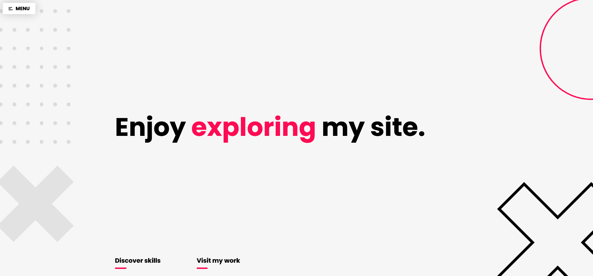
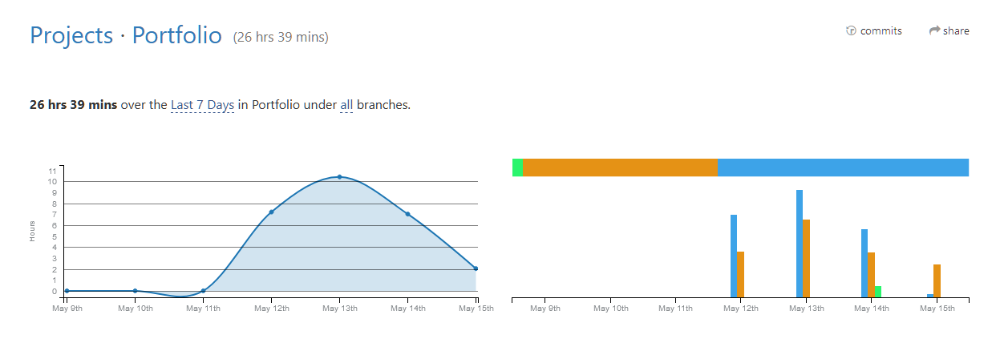

  

# Portfolio Website

> Website creator by: **Achraf Atauil**

# What is the website made with?
## Front-end

* HTMl
* CSS
* Javascript
  
## Libraries & Frameworks

* VueJS ( Vue-Router)
* Vue-kinesis
* Sass
* Normalize-scss

## Hosting & domain

* Netlify
* NameCheap

# In how much time is the website made?

First commit: **May 12, 2020**  
Final<b>*</b> commit: **May 14, 2020**

>  Final here means ready tu use as my portfolio. This does not include **Extensive testing**, **Meta descriptions**, **Optimizations**  & **Advanced Animations**. I do expect to do this in the near future. Also I will constantly update the content of the website as I progress during my career.

## WakaTime Time logging

  

# Project setup
> npm install

## Compiles and hot-reloads for development
   
> npm run serve

## Compiles and minifies for production
  
> npm run build

## Lints and fixes files
   
>npm run lint

